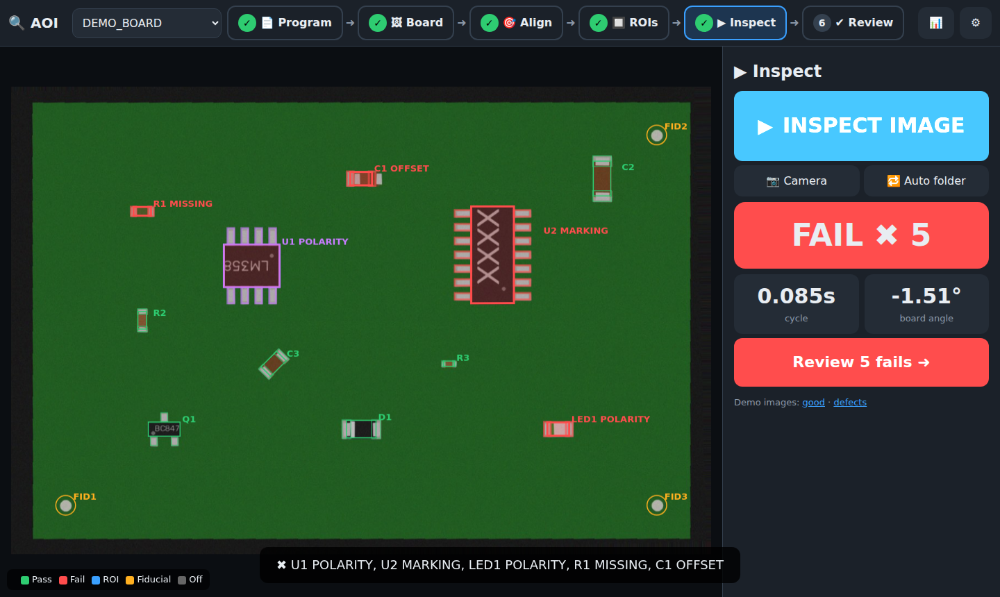

# Background Desktop Saver + Desktop Buddy

This repository now includes two Windows desktop experiments:

- `desktop_saver_game.py`: a simple game attached to desktop background layering.
- `desktop_buddy.py`: a staged virtual desktop buddy prototype with transparent overlay rendering, state machine behavior, and local SQLite memory.

## Desktop Buddy stages implemented

1. **Stage 1: Transparent overlay foundation**
   - Borderless layered window.
   - Click-through passive mode vs interactive mode.
2. **Stage 2: Animation + finite state machine**
   - States: `IDLE`, `WALKING`, `INTERACTING`, `WORKING`, `SLEEPING`.
   - Animated sprite-like circle and simple motion loop.
3. **Stage 3: Local memory and adaptation**
   - SQLite database `buddy_memory.sqlite3`.
   - Logs interaction events and adapts walking probability.
4. **Stage 4: Polish hooks**
   - CPU-throttled render loop.
   - Status text and state-aware rendering.

## Run

```bash
python desktop_buddy.py
```

Press `Esc` to quit.

## Notes

- Target platform: **Windows 10/11** (uses Win32 via `ctypes`).
- Current environment here may not display GUI unless running on a Windows desktop session.

---

# PCBA AOI (pick-and-place driven)

Stand-alone Automated Optical Inspection that builds its program straight from the
pick-and-place placement list (MYData / TPSys export, CAD CSV, KiCad `.pos`, Altium pick-and-place).



## Start

* **Windows:** double-click `run_aoi.bat` (needs Python 3.10+). Browser opens at http://localhost:5050
* Other: `pip install -r requirements-aoi.txt && python -m aoi.app`
* Data (programs, history, learned images) is kept in `~/aoi_data` (change with `AOI_DATA`).

Press **🧪 Try the demo board** to see the whole flow with a generated board and defects.

## Flow (6 big steps across the top)

| Step | What you do |
|---|---|
| 1 📄 Program | Import placement file. Units auto-detected (µm from MYData converted to mm). Packages are derived from package/part names (0402…2512, SOT-23/223/89, SOD, SMA/B/C, SOIC, TSSOP/MSOP, QFP, QFN, DPAK, tantalum, LED). Bottom-side parts skipped. |
| 2 🖼 Board | Upload / snap a **known-good** board image. |
| 3 🎯 Align | Fiducials found automatically; otherwise click any 2 fiducials or parts. ↕ Flip Y if the CAD origin is top-left. |
| 4 🔲 ROIs | Click a part: arrows nudge it, ⟳ rotates, L/W resize the whole package, toggle checks, skip parts. |
| 5 ▶ Inspect | Upload / camera / 🔁 auto-folder (point at the folder your camera saves to). Big PASS/FAIL. |
| 6 ✔ Review | Golden vs this board side by side. **✖ Real defect** or **✔ False call – learn it** (keys `d` / `f`). |

📊 Stats: first pass yield, false call rate, cycle time, defect pareto by type / part / package.
⚙ Settings: sensitivity sliders and the optional AI section.

## How the inspection works

* **Alignment:** fiducial template matching on the golden board → similarity transform; falls back to ORB feature matching. The test board is warped into the golden frame, so any shift / rotation of the board is removed.
* **Lighting robustness:** CLAHE on every image, normalised correlation and z-normalised body comparison (insensitive to brightness/contrast changes).
* **Missing:** body region appearance vs golden + template match.
* **Polarity:** does the 180°-rotated golden fit better than the normal one (whole part and body-marking gradients)?
* **Marking (OCV):** gradient correlation of the body text area. Optional OCR read-out with `pytesseract`.
* **Offset:** local search ± search range, offset reported in mm.
* **False-call learning:** accepted images are stored per part (last 12) and used as extra good references.

## AI (optional, Advanced ⚙)

Off by default – everything works without a key. When on (Anthropic API key), it can:
* summarise yield / pareto / false-call data and suggest actions for the next build (stats only, no images, no customer data);
* give a second opinion on one flagged part (golden + test crop) when you press the button.

## Tests

`python -m pytest tests` – imports, package derivation, clean boards pass under lighting/rotation changes, all 7 injected defects detected with the right type, false-call learning.
